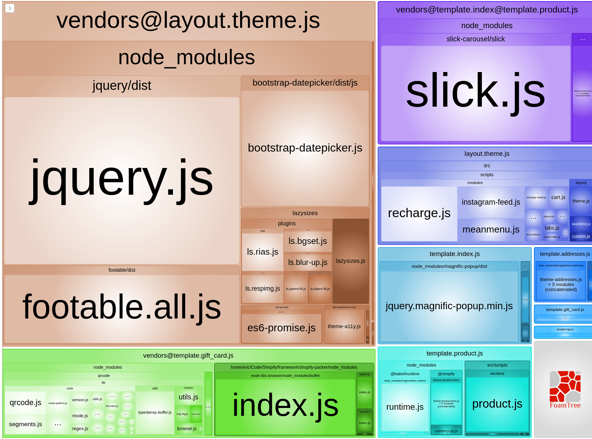

Template and layout bundles are a build-time optimization which ensures
that only the JS and CSS needed for the current page is downloaded and
executed. This optimization results in improved page load speed,
especially on mobile devices with limited computing power and network capacity.

In order to take advantage of template and layout bundles,
your Packer project's src/script/ folder must include the following folders:

```
└── src
   └── scripts
   │   ├── layout
   │   └── templates
   ├── layout
   └── templates
```

### Automatic bundle creation
On build, Packer will look for each file in the src/scripts/layout and
src/scripts/templates folders and see if there is a matching file
in the src/layout and src/templates folders. If there is a match, a
template or layout bundle is created for that match.

```
└── src
   └── scripts
   │   ├── layout
   │   │   └── theme.js
   │   └── templates
   │       ├── index.js
   │       └── product.js
   ├── layout
   │   └── theme.liquid
   └── templates
       ├── index.liquid
       └── product.liquid
```
Using the example above and calling packer build, Packer will look for matching template and
layout files inside the src/scripts/ folder and generate the following JS bundles:

- ``layout.theme.js``: Both ``theme.liquid`` and ``theme.js`` exist.
- ``template.index.js``: Both ``index.liquid`` and ``index.js`` exist.
- ``template.product.js``: Both ``product.liquid`` and ``product.js`` exist.

Note that the following bundles **are not** generated:

- ``template.page.about-us.js``: Packer cannot find a ``src/template/page.about-us.liquid`` file.
- ``template.collection.js``: Packer cannot find a ``scripts/templates/collection.js`` file.

### Shared JS dependencies chunking
A critical optimization needed for template and layout bundles to be successful
is to split shared dependencies between bundles into separate chunks.
This reduces the amount of duplicate code included in each bundle and
further improves page load performance.

Let's continue with the file structure from the previous example, and
see how shared dependencies are separated:

*index.js*
```
@import depA from 'depA';
@import depB from 'depB';
```

*index.js*
```
@import depB from 'depB';
@import depC from 'depC';
```

In the example above, we have 2 files which each import 2 dependencies.
Both files have a shared dependency, depB. Instead of bundling depB into
template.index.js and again in template.product.js, Packer splits depB
into its own bundle chunk. The resulting generated files are:

- ``template.index.js``: Code that is only used on the index template.
- ``template.product.js``: Code that is only used on the product template.
- ``template.index@template.product.js``: Code that is used on both index and product templates.

### Template and layout styles
It's also possible to structure your styles so that only those needed
for the current page are loaded. This is made possible by the JS bundling
mentioned above. Let's take a look at what a typical Packer project might
look like and how it would take advantage of template and layout styles.

*layout/theme.js*
```scss
import '../../styles/layout/theme.scss';
```

*layout/product.js*
```scss
import '../../styles/templates/product.scss';
```

Looking at the above examples, we can see that we are importing two
different SCSS files. We can expect that ``theme.scss`` contains global
styles that are used through most of the theme's pages, such as header
and navigation styles. ``product.scss`` might include styles that are
specific to the product template, such as a product image gallery.

The following imports would generate the following files:

- ``layout.theme.css.liquid``
- ``template.product.css.liquid``

### Including generated bundles in your theme
Now that you have template and layout bundles with shared dependency chunking,
you'll notice that there are a lot of JS files in your compiled Packer project
(found in the dist folder). It would be pretty tedious to code and manage
all the ``<script>`` tags for each of these assets. So let's have Packer handle this!

packer generates ``script-tags.liquid`` and ``styles-tags.liquid`` snippets
which include ``<script>`` and ``<link>`` tags needed for each bundle.
These snippets also include all the liquid logic needed to selectively load
these bundles based on the current template and layout.
All you need to do is include these snippets in your layout files.

For example, here is what you would include in your ``layout/theme.liquid``:

```


```
where the layout option value is the name of the layout.

### Bundle analyzer
Packer's [build script](/docs/commands#build) can use Webpack Bundle Analyzer to see what's inside each bundle for further optimization

