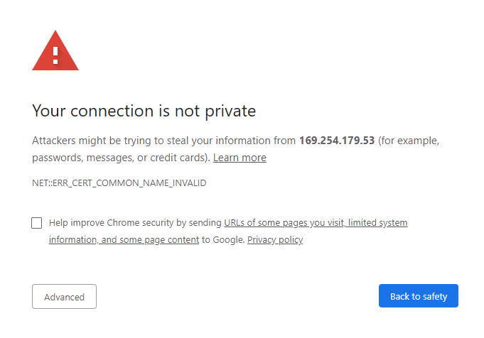
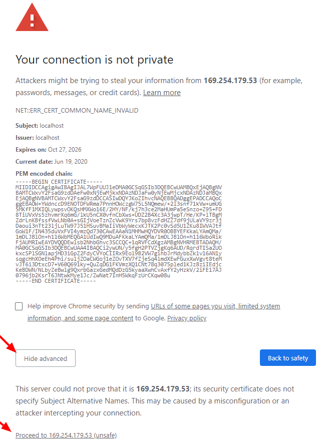

Packer uses a local server which compiles and serves theme JavaScript and CSS locally. By serving these assets locally, developers don't need to wait for them to be uploaded to Shopify servers to preview the changes they are making. When combined with Hot Module Reloading, developers see changes in their code reflected almost instantly.

:::caution
For the local server to function properly you must have SSL setup properly.
:::

Developers wanting to share an instance of their store with other developers are often confused when they see their store appear broken. Because CSS and JavaScript are being served locally, your theme won’t function on any machine other than the one the Express server is currently running on.

When SSL is not working your css/js will be blocked in the browser and
the site will appear broken. You can also see the requests being blocked
in the network tab chrome developer tools. There are two methods for fixing this:

### Accept default cert
This is the fastest method but will often have to be repeated
1. Run start/watch
2. When browser launches if there is a warning follow these steps
    1. Click advanced

   

    2. Click proceed

   

### Create self signed cert
Create a trusted, self-signed SSL certificate on your device so the
assets, served via https, are never blocked.

Packer will look for the certificate with extension `.cer` or `.crt`
in ``~/.localhost_ssl`` it will be in the users home directory

The certificate common name must match the ip you are using with Packer.
When your IP changes you will need to make a new cert

Packer can create an SSL cert for you using the `packer ssl:make` command, 
see [commands](commands.md) for usage